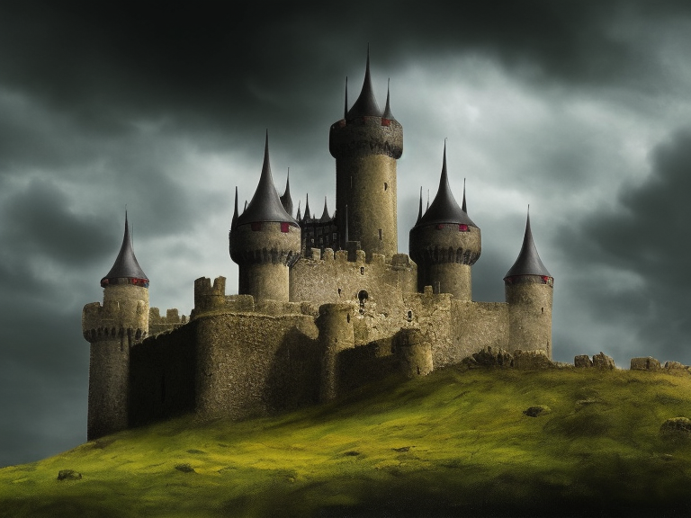

# GoCastle

## Introduction

This project is my journey to creating a graphical game while learning Golang

Every session, I'll add an entry in this file telling what I did and what I learned

## 2023-07-07

I'm going to use [fyne](https://developer.fyne.io/started/) toolkit which is a simple tool to create graphical user interfaces in Golang. It seems to be simple enough, I hope it's not too small.

**Installing prerequisites**

```bash
sudo apt-get install golang gcc libgl1-mesa-dev xorg-dev
```

And then reboot

Creating a directory and bootstraping golang project

```bash
mkdir gocastle
cd gocastle
```

**Bootstrap app**

Creating a new go module

```bash
go mod init gocastle
go: creating new go.mod: module gocastle
go: to add module requirements and sums:
        go mod tidy
zwindler@normandy:/windows/Users/zwindler/sources/gocastle$ 
```

Creating a main.go file

```golang
package main

import (
	"fyne.io/fyne/v2/app"
	"fyne.io/fyne/v2/container"
	"fyne.io/fyne/v2/widget"
)

func main() {
	myApp := app.New()
	mainWindow := myApp.NewWindow("GoCastle")

	newGameButton := widget.NewButton("New Game", func() {
	})
	loadGameButton := widget.NewButton("Load Game", func() {
	})
	quitButton := widget.NewButton("Quit", func() {
		myApp.Quit()
	})

	menu := container.NewVBox(
		newGameButton,
		loadGameButton,
		quitButton,
	)

	mainWindow.SetContent(menu)
	mainWindow.ShowAndRun()
}
```

Init the project, download fyne, build and run it

```bash
go mod init gocastle
go mod tidy
go build
./gocastle
```

It will crash with this error if you haven't rebooted (cf https://github.com/ScenicFramework/scenic_driver_glfw/issues/6#issuecomment-419741773)

```
GLX: Failed to create context: BadValue (integer parameter out of range for operation)
```

## 2023-07-09

I've added a fixed size for the windows

```go
    mainWindow.SetFixedSize(true)
    mainWindow.Resize(fyne.NewSize(800, 600))
```

And a Makefile to save some time

I can now rebuild and launch with 

```bash
make buildrun
```

Don't use the VBox layout of else the buttons will take the whole width

```go
menu := container.NewWithoutLayout
```

Add size and positions for the buttons

```go
	defaultButtonSize := fyne.NewSize(100, 40)
	newGameButton.Resize(defaultButtonSize)
	loadGameButton.Resize(defaultButtonSize)
	quitButton.Resize(defaultButtonSize)

	newGameButton.Move(fyne.NewPos(350, 220))
	loadGameButton.Move(fyne.NewPos(350, 275))
	quitButton.Move(fyne.NewPos(350, 330))
```

Generate an castle image for the first screen with stable diffusion and add a background image



Split code (create a special package to separate code for each screen) and add some new screens (new game and load game, empty for now)

```
screens/
	loadgame.go
	mainmenu.go
	newgame.go
```

Add a gitignore and move binary to bin/ directory

Added a lot of widgets in the new game screen, some logic is missing (number of points to allocate to personalize player)

```go
	firstLine := container.NewHBox(
		characterNameLabel,
		characterNameEntry,
	)

	slidersLine := container.New(layout.NewGridLayout(5),
		pointsToSpendLabel, strengthLabel, constitutionLabel, intelligenceLabel, dexterityLabel,
		pointsToSpendValue, strengthRange, constitutionRange, intelligenceRange, dexterityRange)

	lastLine := container.NewHBox(
		backButton,
		validateButton,
	)
```

Also, "entry" with Character name is broken due to NewHBox. See https://github.com/fyne-io/fyne/issues/3337

## 2023-07-11

Still working on character creation menu. I'm looking into the issue I previously linked to fix entry for character name.

Solution found in [FyneConf 2021 Session 3 - Layouts youtube video](https://www.youtube.com/watch?v=LWn1403gY9E)

```go
	firstLine := container.New(layout.NewFormLayout(),
		characterNameLabel,
		characterNameEntry,
	)
```

Also interesting, I've found out about NewBorderLayout

I created a nice function to factorize slider creation and "points to allocate" logic

```
[...]
	strengthLabel := widget.NewLabel("Strength: 10")
	strengthRange := createSliderWithCallback("Strength", 5, 30,
		10, &StrengthValue, &PointsToSpend,
		strengthLabel, pointsToSpendValue)
[...]
func createSliderWithCallback(characteristic string, min float64, max float64,
	defaultValue float64, value *float64, pointsToSpend *float64,
	valueLabel, pointsToSpendLabel *widget.Label) *widget.Slider {
	slider := widget.NewSlider(min, max)
	slider.Value = defaultValue
	slider.OnChanged = func(v float64) {
		if (*pointsToSpend - (v - *value)) >= 0 {
			*pointsToSpend = *pointsToSpend - (v - *value)
			*value = v
		} else {
			slider.Value = *value
			slider.Refresh()
		}
		valueLabel.SetText(fmt.Sprintf("%s: %.0f", characteristic, *value))
		pointsToSpendLabel.SetText(fmt.Sprintf("%.0f", *pointsToSpend))
		valueLabel.Refresh()
	}
	return slider
}
```

## 2023-07-13

Added my first popup to tell player he/she forgot to allocate some point in character creation screen.

```go
		if PointsToSpend > 0 {
			content := widget.NewLabel("You still have available characteristics point to allocate!")
			dialog.ShowCustom("Points still available", "Close", content, window)
		}
```

```go
	characterGenderLabel := widget.NewLabel("Gender")
	genderRadioButton := widget.NewRadioGroup([]string{"Female", "Male", "Non-binary"}, func(selected string) {
	})

	characterAspect := widget.NewRadioGroup([]string{"👩‍🌾", "🧑‍🌾", "👨‍🌾", "🧙‍♀️", "🧙", "🧙‍♂️", "🦹‍♂️", "🥷", "🧝‍♀️", "🧝", "🧝‍♂️"}, func(selected string) {
	})
```

Added gender selection radio buttons + aspect selection button. Discovered that fyne 2.3 doesn't support emoji yet...

*[](https://github.com/fyne-io/fyne/issues/573)